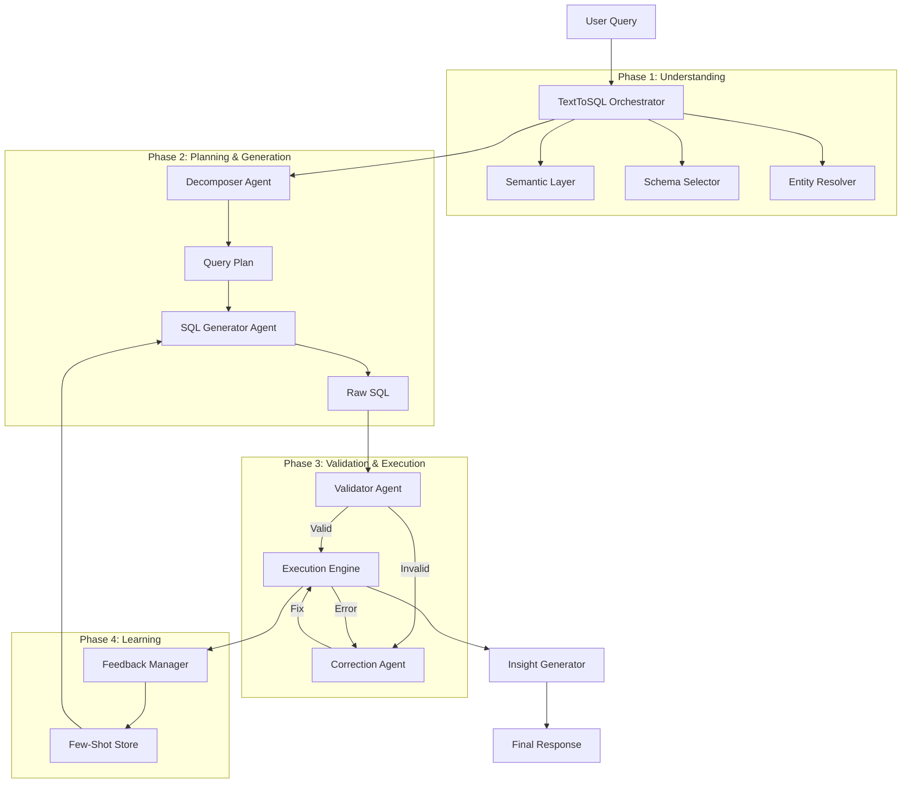

# Demand Management GenAI Chatbot

A production-grade Text-to-SQL system powered by a **Multi-Agent Architecture**. This chatbot allows users to query demand management data using natural language, leveraging advanced techniques like **Semantic Layers**, **Chain-of-Thought Decomposition**, and **Active Learning**.

---

##  Architecture Overview

The system has moved away from a monolithic LLM call to a modular **Agent Swarm**. Each agent is responsible for a specific stage of the pipeline, orchestrated by the `TextToSQLOrchestrator`.

### High-Level Data Flow




---

##  Core Components

### 1. The Semantic Layer (`agents/semantic_layer.py`)
The "Brain" of the system. It abstracts the raw database schema into business concepts.
- **`business_metrics.json`**: Defines formulas (e.g., "Attrition Rate = Terminations / Headcount").
- **`entity_mappings.json`**: Maps fuzzy terms to canonical DB values (e.g., "GenAI Initiative" → "Project ID 501").
- **`join_paths.json`**: Pre-defined safe join paths to avoid cartesian products.

### 2. The Agent Swarm (`agents/`)

| Agent | Responsibility |
|-------|----------------|
| **SchemaSelector** | Filters the 50+ table schema down to the top-K relevant tables using simulated vector search. |
| **EntityResolver** | Detects named entities (projects, people) in the user query and maps them to IDs using fuzzy matching. |
| **Decomposer** | Breaks down name, complex questions (e.g., "Compare X and Y") into logical steps. |
| **SQLGenerator** | Writes the SQL. Uses strict **Chain-of-Thought** logic and injects relevant **Few-Shot Examples**. |
| **Validator**| Runs `EXPLAIN` and Regex checks to catch syntax errors and logic hallucinations before execution. |
| **ExecutionEngine** | Safely runs the query with timeouts and error formatting. |
| **CorrectionAgent** | If Validation or Execution fails, this agent analyzes the error and attempts to rewrite the SQL automatically. |
| **Orchestrator** | (`orchestrator.py`) Wires all agents together, managing the data flow and error handling loops. |

### 3. Active Learning Loop (`agents/feedback_manager.py`)
The system gets smarter over time.
- **Logging**: Every query (Success/Failure) is logged to `feedback_history.json`.
- **Dynamic Few-Shot**: When generating SQL, the `SQLGenerator` looks up past similar successful queries to use as examples.
- **Correction**: If a user flagged a query as wrong, the system ensures it helps avoiding that mistake in the future.

---

##  Getting Started

### Prerequisites
- Python 3.9+
- PostgreSQL Database
- Groq API Key (for LLM inference)

### Installation
1. Clone the repository.
2. Install dependencies:
   ```bash
   pip install -r requirements.txt
   ```
3. Set up environment variables in `.env`:
   ```ini
   GROQ_API_KEY=gsk_...
   DB_HOST=localhost
   DB_NAME=demand_db
   DB_USER=postgres
   DB_PASSWORD=password
   ```

### Running the Chatbot
To start the interactive CLI:
```bash
python app.py
```

### Running Tests
To verify the architecture integrity:
```bash
python verify_orchestrator.py
```

---

##  Directory Structure

```
C:\PROJECT\INTERNAL\GENAI_CHATBOT
├── agents/                  # <--- NEW Multi-Agent Package
│   ├── orchestrator.py      # Main pipeline controller
│   ├── semantic_layer.py    # Interface to JSON definitions
│   ├── schema_selector.py   # RAG for constraints/tables
│   ├── entity_resolver.py   # Named Entity Recognition
│   ├── decomposer.py        # Query Planner
│   ├── sql_generator.py     # Code writer
│   ├── validator.py         # Code reviewer
│   ├── execution_engine.py  # Runtime
│   ├── correction_agent.py  # Auto-fixer
│   └── feedback_manager.py  # Active Learning
├── semantic_layer/          # JSON Definitions
│   ├── business_metrics.json
│   ├── data_dictionary.json
│   └── entity_mappings.json
├── app.py                   # Main Entry Point
├── chatbot.py               # Integration layer
├── llm.py                   # Legacy LLM functions (deprecated logic)
└── requirements.txt
```

---

#project-genai #text-to-sql #multi-agent
